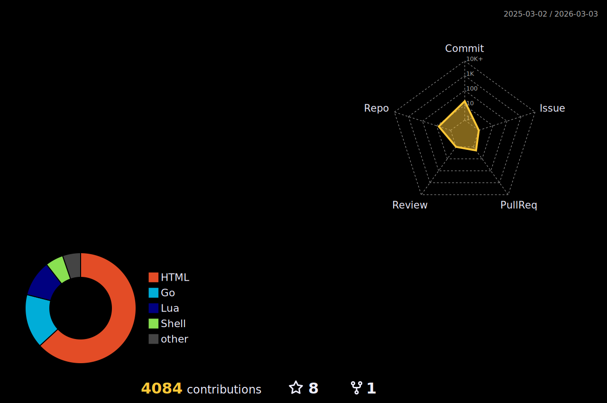

<p align="center"></p>

<p align="center">
  
  
</p>


<p align="center">
  
</p>


- 🌱 I’m currently learning **Go**, **Rust**

- 👨‍💻 All of my projects are available at [https://shake551.github.io/portfolio/](https://shake551.github.io/portfolio/)

- 📝 I regularly write articles on [https://zenn.dev/shake_sanma](https://zenn.dev/shake_sanma)


<h3 align="left">🛠️Languages and Tools:</h3>
<p align="left"> <a href="https://aws.amazon.com" target="_blank" rel="noreferrer">  </a> <a href="https://www.gnu.org/software/bash/" target="_blank" rel="noreferrer">  </a> <a href="https://www.blender.org/" target="_blank" rel="noreferrer">  </a> <a href="https://www.cprogramming.com/" target="_blank" rel="noreferrer">  </a> <a href="https://www.chartjs.org" target="_blank" rel="noreferrer">  </a> <a href="https://www.w3schools.com/cpp/" target="_blank" rel="noreferrer">  </a> <a href="https://www.w3schools.com/css/" target="_blank" rel="noreferrer">  </a> <a href="https://dart.dev" target="_blank" rel="noreferrer">  </a> <a href="https://www.djangoproject.com/" target="_blank" rel="noreferrer">  </a> <a href="https://www.docker.com/" target="_blank" rel="noreferrer">  </a> <a href="https://expressjs.com" target="_blank" rel="noreferrer">  </a> <a href="https://flask.palletsprojects.com/" target="_blank" rel="noreferrer">  </a> <a href="https://flutter.dev" target="_blank" rel="noreferrer">  </a> <a href="https://git-scm.com/" target="_blank" rel="noreferrer">  </a> <a href="https://golang.org" target="_blank" rel="noreferrer">  </a> <a href="https://heroku.com" target="_blank" rel="noreferrer">  </a> <a href="https://www.w3.org/html/" target="_blank" rel="noreferrer">  </a> <a href="https://www.adobe.com/in/products/illustrator.html" target="_blank" rel="noreferrer">  </a> <a href="https://www.java.com" target="_blank" rel="noreferrer">  </a> <a href="https://developer.mozilla.org/en-US/docs/Web/JavaScript" target="_blank" rel="noreferrer">  </a> <a href="https://kafka.apache.org/" target="_blank" rel="noreferrer">  </a> <a href="https://laravel.com/" target="_blank" rel="noreferrer">  </a> <a href="https://www.linux.org/" target="_blank" rel="noreferrer">  </a> <a href="https://www.mathworks.com/" target="_blank" rel="noreferrer">  </a> <a href="https://www.mysql.com/" target="_blank" rel="noreferrer">  </a> <a href="https://www.nginx.com" target="_blank" rel="noreferrer">  </a> <a href="https://nodejs.org" target="_blank" rel="noreferrer">  </a> <a href="https://www.photoshop.com/en" target="_blank" rel="noreferrer">  </a> <a href="https://www.php.net" target="_blank" rel="noreferrer">  </a> <a href="https://www.postgresql.org" target="_blank" rel="noreferrer">  </a> <a href="https://postman.com" target="_blank" rel="noreferrer">  </a> <a href="https://www.python.org" target="_blank" rel="noreferrer">  </a> <a href="https://reactjs.org/" target="_blank" rel="noreferrer">  </a> <a href="https://redis.io" target="_blank" rel="noreferrer">  </a> <a href="https://www.selenium.dev" target="_blank" rel="noreferrer">  </a> <a href="https://spring.io/" target="_blank" rel="noreferrer">  </a> <a href="https://www.sqlite.org/" target="_blank" rel="noreferrer">  </a> <a href="https://unity.com/" target="_blank" rel="noreferrer">  </a> <a href="https://www.adobe.com/products/xd.html" target="_blank" rel="noreferrer">  </a> </p>

<br>

<h3 align="left">📊Weekly development breakdown:</h3>
<!--START_SECTION:waka-->
**🐱 My GitHub Data** 

> 📦 54.6 kB Used in GitHub's Storage 
 > 
> 🏆 541 Contributions in the Year 2023
 > 
> 🚫 Not Opted to Hire
 > 
> 📜 37 Public Repositories 
 > 
> 🔑 46 Private Repositories 
 > 
**I'm an Early 🐤** 

```text
🌞 Morning                329 commits         █████░░░░░░░░░░░░░░░░░░░░   18.22 % 
🌆 Daytime                628 commits         █████████░░░░░░░░░░░░░░░░   34.77 % 
🌃 Evening                697 commits         ██████████░░░░░░░░░░░░░░░   38.59 % 
🌙 Night                  152 commits         ██░░░░░░░░░░░░░░░░░░░░░░░   08.42 % 
```
📅 **I'm Most Productive on Sunday** 

```text
Monday                   350 commits         █████░░░░░░░░░░░░░░░░░░░░   19.38 % 
Tuesday                  189 commits         ███░░░░░░░░░░░░░░░░░░░░░░   10.47 % 
Wednesday                163 commits         ██░░░░░░░░░░░░░░░░░░░░░░░   09.03 % 
Thursday                 185 commits         ███░░░░░░░░░░░░░░░░░░░░░░   10.24 % 
Friday                   199 commits         ███░░░░░░░░░░░░░░░░░░░░░░   11.02 % 
Saturday                 279 commits         ████░░░░░░░░░░░░░░░░░░░░░   15.45 % 
Sunday                   441 commits         ██████░░░░░░░░░░░░░░░░░░░   24.42 % 
```


📊 **This Week I Spent My Time On** 

```text
🕑︎ Time Zone: Asia/Tokyo

💬 Programming Languages: 
TypeScript               7 hrs 28 mins       █████████░░░░░░░░░░░░░░░░   36.37 % 
Go                       5 hrs 31 mins       ███████░░░░░░░░░░░░░░░░░░   26.85 % 
Dart                     2 hrs 59 mins       ████░░░░░░░░░░░░░░░░░░░░░   14.52 % 
SQL                      1 hr 42 mins        ██░░░░░░░░░░░░░░░░░░░░░░░   08.31 % 
Terraform                51 mins             █░░░░░░░░░░░░░░░░░░░░░░░░   04.16 % 

🔥 Editors: 
Neovim                   17 hrs 9 mins       █████████████████████░░░░   83.49 % 
Android Studio           3 hrs 1 min         ████░░░░░░░░░░░░░░░░░░░░░   14.68 % 
GoLand                   21 mins             ░░░░░░░░░░░░░░░░░░░░░░░░░   01.77 % 
VS Code                  0 secs              ░░░░░░░░░░░░░░░░░░░░░░░░░   00.06 % 
```

**I Mostly Code in JavaScript** 

```text
JavaScript               28 repos            ███████░░░░░░░░░░░░░░░░░░   29.17 % 
Go                       13 repos            ███░░░░░░░░░░░░░░░░░░░░░░   13.54 % 
Dart                     7 repos             ██░░░░░░░░░░░░░░░░░░░░░░░   07.29 % 
TypeScript               3 repos             █░░░░░░░░░░░░░░░░░░░░░░░░   03.12 % 
Lua                      1 repo              ░░░░░░░░░░░░░░░░░░░░░░░░░   01.04 % 
```


 Last Updated on 29/03/2023 12:13:54 UTC
<!--END_SECTION:waka-->


<h3 align="left">🔥My Status:</h3>

<p align="center">
  
</p>
  
<p align="center">


</p>

[](https://github.com/ryo-ma/github-profile-trophy)

<details>
  <summary><h3>📈&nbsp;&nbsp;Language&nbsp;/&nbsp;Framework stats</h3></summary>
  <br/>
  <a href='https://profile.codersrank.io/user/shake551/'>
    
  </a>

</details>
