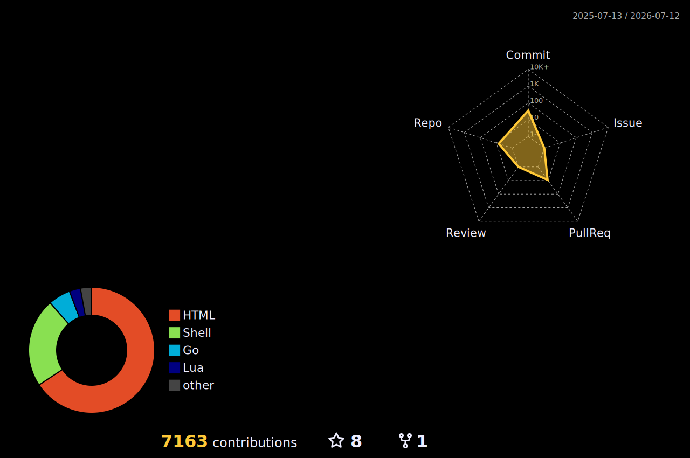

<p align="center"></p>

<p align="center">
  
  
</p>


<p align="center">
  
</p>


- 🌱 I’m currently learning **Go**, **Flutter**

- 👨‍💻 All of my projects are available at [https://shake551.github.io/portfolio/](https://shake551.github.io/portfolio/)

- 📝 I regularly write articles on [https://zenn.dev/shake_sanma](https://zenn.dev/shake_sanma)

- 🍏 I am distributing some apps on [https://apps.apple.com/jp/developer/hiroki-yamauchi/id1679157574](https://apps.apple.com/jp/developer/hiroki-yamauchi/id1679157574)


<h3 align="left">🛠️Languages and Tools:</h3>
<h4 align="left">Programming Languages</h4>


<h4 align="left">Frontend Development</h4>


<h4 align="left">Backend Development</h4>


<h4 align="left">Mobile App Development</h4>


<h4 align="left">Database</h4>


<h4 align="left">Data Visualization</h4>


<h4 align="left">Devops</h4>


<h4 align="left">Backend as a Service</h4>


<h4 align="left">Framework</h4>


<h4 align="left">Testing</h4>


<h4 align="left">CI/CD</h4>


<h4 align="left">Tools</h4>


<br>

<h3 align="left">📊Weekly development breakdown:</h3>
<!--START_SECTION:waka-->
**🐱 My GitHub Data** 

> 📦 379.7 kB Used in GitHub's Storage 
 > 
> 🏆 1,906 Contributions in the Year 2026
 > 
> 🚫 Not Opted to Hire
 > 
> 📜 70 Public Repositories 
 > 
> 🔑 67 Private Repositories 
 > 
**I'm an Early 🐤** 

```text
🌞 Morning                13102 commits       ████░░░░░░░░░░░░░░░░░░░░░   16.35 % 
🌆 Daytime                40648 commits       █████████████░░░░░░░░░░░░   50.73 % 
🌃 Evening                19081 commits       ██████░░░░░░░░░░░░░░░░░░░   23.81 % 
🌙 Night                  7295 commits        ██░░░░░░░░░░░░░░░░░░░░░░░   09.10 % 
```
📅 **I'm Most Productive on Tuesday** 

```text
Monday                   11307 commits       ████░░░░░░░░░░░░░░░░░░░░░   14.11 % 
Tuesday                  17365 commits       █████░░░░░░░░░░░░░░░░░░░░   21.67 % 
Wednesday                16726 commits       █████░░░░░░░░░░░░░░░░░░░░   20.87 % 
Thursday                 13547 commits       ████░░░░░░░░░░░░░░░░░░░░░   16.91 % 
Friday                   12986 commits       ████░░░░░░░░░░░░░░░░░░░░░   16.21 % 
Saturday                 3527 commits        █░░░░░░░░░░░░░░░░░░░░░░░░   04.40 % 
Sunday                   4668 commits        █░░░░░░░░░░░░░░░░░░░░░░░░   05.83 % 
```


📊 **This Week I Spent My Time On** 

```text
🕑︎ Time Zone: Asia/Tokyo

💬 Programming Languages: 
No Activity Tracked This Week

🔥 Editors: 
No Activity Tracked This Week
```

**I Mostly Code in Python** 

```text
Python                   34 repos            ██████░░░░░░░░░░░░░░░░░░░   22.37 % 
Go                       27 repos            ████░░░░░░░░░░░░░░░░░░░░░   17.76 % 
TypeScript               12 repos            ██░░░░░░░░░░░░░░░░░░░░░░░   07.89 % 
HTML                     9 repos             █░░░░░░░░░░░░░░░░░░░░░░░░   05.92 % 
Shell                    4 repos             █░░░░░░░░░░░░░░░░░░░░░░░░   02.63 % 
```


 Last Updated on 08/04/2026 01:40:50 UTC
<!--END_SECTION:waka-->


<h3 align="left">🔥My Status:</h3>

<p align="center">
  
</p>
  
<p align="center">


</p>

[](https://github.com/ryo-ma/github-profile-trophy)

<details>
  <summary><h3>📈&nbsp;&nbsp;Language&nbsp;/&nbsp;Framework stats</h3></summary>
  <br/>
  <a href='https://profile.codersrank.io/user/shake551/'>
    
  </a>

</details>
