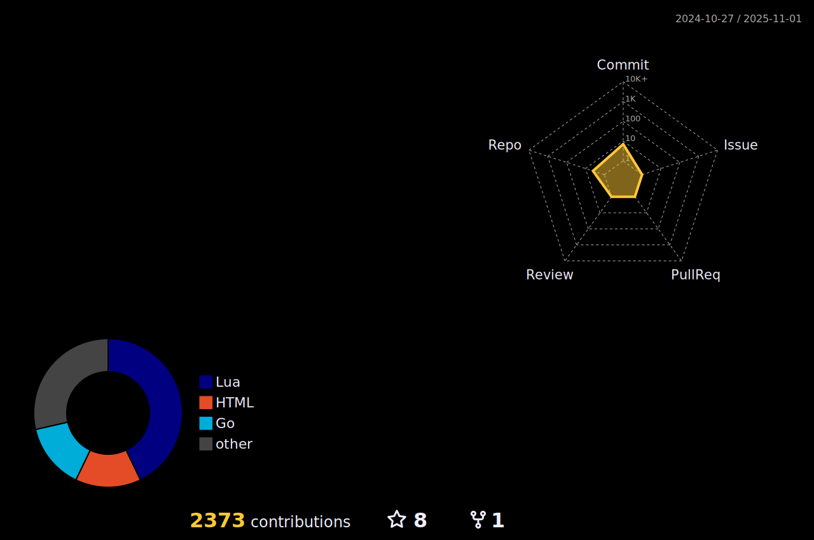

<p align="center"></p>

<p align="center">
  
  
</p>


<p align="center">
  
</p>


- 🌱 I’m currently learning **Go**, **Flutter**

- 👨‍💻 All of my projects are available at [https://shake551.github.io/portfolio/](https://shake551.github.io/portfolio/)

- 📝 I regularly write articles on [https://zenn.dev/shake_sanma](https://zenn.dev/shake_sanma)


<h3 align="left">🛠️Languages and Tools:</h3>
<h4 align="left">Programming Languages</h4>


<h4 align="left">Frontend Development</h4>


<h4 align="left">Backend Development</h4>


<h4 align="left">Mobile App Development</h4>


<h4 align="left">Database</h4>


<h4 align="left">Data Visualization</h4>


<h4 align="left">Devops</h4>


<h4 align="left">Backend as a Service</h4>


<h4 align="left">Framework</h4>


<h4 align="left">Testing</h4>


<h4 align="left">CI/CD</h4>


<h4 align="left">Tools</h4>


<br>

<h3 align="left">📊Weekly development breakdown:</h3>
<!--START_SECTION:waka-->
**🐱 My GitHub Data** 

> 📦 78.2 kB Used in GitHub's Storage 
 > 
> 🏆 1,306 Contributions in the Year 2023
 > 
> 🚫 Not Opted to Hire
 > 
> 📜 43 Public Repositories 
 > 
> 🔑 47 Private Repositories 
 > 
**I'm a Night 🦉** 

```text
🌞 Morning                464 commits         ███░░░░░░░░░░░░░░░░░░░░░░   12.95 % 
🌆 Daytime                1240 commits        █████████░░░░░░░░░░░░░░░░   34.62 % 
🌃 Evening                1667 commits        ████████████░░░░░░░░░░░░░   46.54 % 
🌙 Night                  211 commits         █░░░░░░░░░░░░░░░░░░░░░░░░   05.89 % 
```
📅 **I'm Most Productive on Saturday** 

```text
Monday                   598 commits         ████░░░░░░░░░░░░░░░░░░░░░   16.69 % 
Tuesday                  386 commits         ███░░░░░░░░░░░░░░░░░░░░░░   10.78 % 
Wednesday                266 commits         ██░░░░░░░░░░░░░░░░░░░░░░░   07.43 % 
Thursday                 339 commits         ██░░░░░░░░░░░░░░░░░░░░░░░   09.46 % 
Friday                   473 commits         ███░░░░░░░░░░░░░░░░░░░░░░   13.20 % 
Saturday                 841 commits         ██████░░░░░░░░░░░░░░░░░░░   23.48 % 
Sunday                   679 commits         █████░░░░░░░░░░░░░░░░░░░░   18.96 % 
```


📊 **This Week I Spent My Time On** 

```text
🕑︎ Time Zone: Asia/Tokyo

💬 Programming Languages: 
Dart                     4 hrs 2 mins        █████████░░░░░░░░░░░░░░░░   36.88 % 
TeX                      3 hrs 41 mins       ████████░░░░░░░░░░░░░░░░░   33.63 % 
HTML                     2 hrs 3 mins        █████░░░░░░░░░░░░░░░░░░░░   18.76 % 
Markdown                 24 mins             █░░░░░░░░░░░░░░░░░░░░░░░░   03.73 % 
Go                       18 mins             █░░░░░░░░░░░░░░░░░░░░░░░░   02.79 % 

🔥 Editors: 
Neovim                   10 hrs 57 mins      █████████████████████████   100.00 % 
```

**I Mostly Code in JavaScript** 

```text
Dart                     8 repos             ██░░░░░░░░░░░░░░░░░░░░░░░   07.77 % 
HTML                     8 repos             ██░░░░░░░░░░░░░░░░░░░░░░░   07.77 % 
TeX                      1 repo              ░░░░░░░░░░░░░░░░░░░░░░░░░   00.97 % 
Makefile                 1 repo              ░░░░░░░░░░░░░░░░░░░░░░░░░   00.97 % 
DIGITAL Command Language 1 repo              ░░░░░░░░░░░░░░░░░░░░░░░░░   00.97 % 
```


 Last Updated on 21/06/2023 09:08:09 UTC
<!--END_SECTION:waka-->


<h3 align="left">🔥My Status:</h3>

<p align="center">
  
</p>
  
<p align="center">


</p>

[](https://github.com/ryo-ma/github-profile-trophy)

<details>
  <summary><h3>📈&nbsp;&nbsp;Language&nbsp;/&nbsp;Framework stats</h3></summary>
  <br/>
  <a href='https://profile.codersrank.io/user/shake551/'>
    
  </a>

</details>
