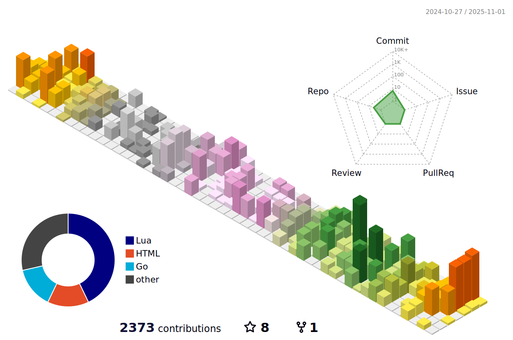

<a href="https://github.com/anuraghazra/github-readme-stats">
  
</a>
<a href="https://github.com/anuraghazra/github-readme-stats">
  
</a>

[](https://github.com/ryo-ma/github-profile-trophy)

📊 **Weekly development breakdown**
<!--START_SECTION:waka-->

```text
Other            11 hrs 42 mins  █████████████████████▓░░░   86.59 %
```

<!--END_SECTION:waka-->
